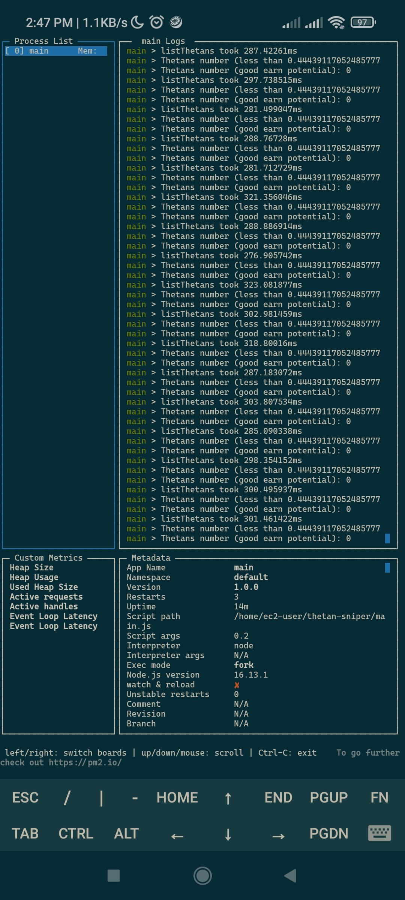
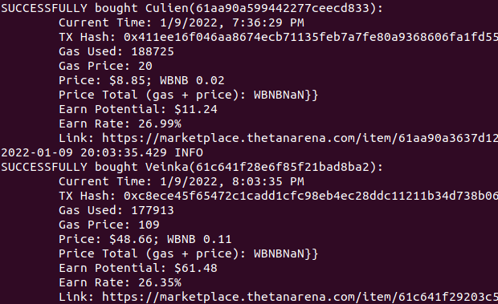
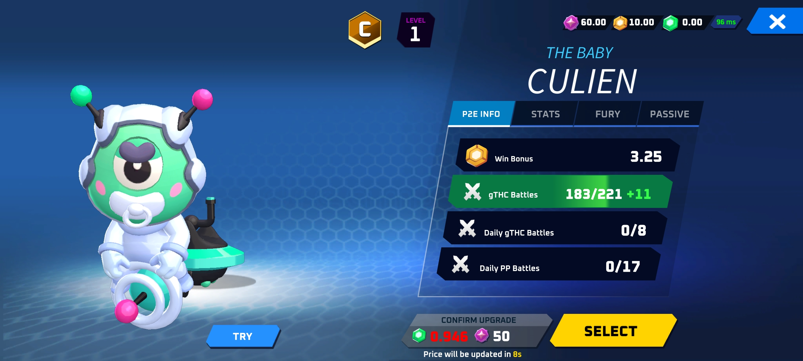
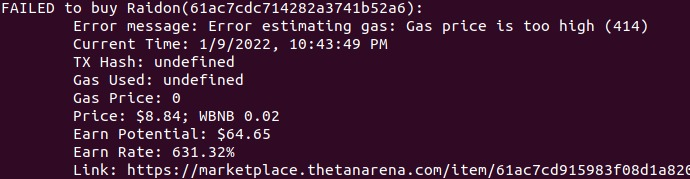

<br />
<p align="center">
  <h3 align="center">Thetan Arena Sniper</h3>
  <p align="center">
  Thetan Arena Sniper is a tool to buy cheap thetans NFTs quickly. It interacts with BSC Blockchain to buy thetans as fast as possible.
    <br />
    :warning: It is a tool in development, I am not responsible for financial losses. :warning:
    <br />
    <br />
    <a href="https://github.com/xandao6/thetan-arena-sniper"><strong>Explore the docs »</strong></a>
    <br />
    <a href="https://github.com/xandao6/thetan-arena-sniper/issue">Report Bug</a>
    ·
    <a href="https://github.com/xandao6/thetan-arena-sniper/issues">Request Feature</a>
  </p>
</p>


<!-- TABLE OF CONTENTS -->
<details open="open">
  <summary>Table of Contents</summary>
  <ol>
    <li>
      <a href="#about-the-project">About The Project</a>
      <ul>
        <li><a href="#introduction">Introduction</a></li>
        <li><a href="#tips">Tips</a></li>
        <li><a href="#features">Features</a></li>
        <li><a href="#built-with">Built With</a></li>
      </ul>
    </li>
    <li>
      <a href="#getting-started">Getting Started</a>
      <ul>
        <li><a href="#installation-local">Installation Local</a></li>
        <li><a href="#installation-ec2-optional">Installation EC2 (Optional)</a></li>
      </ul>
    </li>
    <li><a href="#usage">Usage</a></li>
    <li><a href="#roadmap">Roadmap</a></li>
    <li><a href="#contributing">Contributing</a></li>
    <li><a href="#license">License</a></li>
    <li><a href="#contact">Contact</a></li>
    <li><a href="#acknowledgements">Acknowledgements</a></li>
  </ol>
</details>


<!-- ABOUT THE PROJECT -->
## About The Project

<div align="center">
  <a href="https://github.com/xandao6/thetan-arena-sniper">
    
    
    
    
  </a>
</div>

### Introduction

There are a few things you need to know before using the bot. There are some variables that can be changed according to 
your need, they are in src/utils/constants.js.

First, this bot selects the cheap characters through the Expected Earn Rate which is the percentage of profit in 
relation to the purchase price and the possible sale price.

The sales price estimate is based on how much profit a character can generate. I think it's a good estimate the sale 
price to be the same value that the character manages to generate profit when the win rate is 40%. you can adjust
this value in the constants file in BATTLE_WIN_RATE. You can check how much the character generates by 40% in the 
[Thetan Arena Tool](https://thetanarenatool.io/).

These are the constants I recommend tweaking:
  * MARKETPLACE_BUY_GAS -> The amount of Gwei you can spend, I've generally seen bots using from 200000 to 500000
  * MARKETPLACE_MAX_GAS_PRICE -> The maximum price you can spend on each unit of gas, for example, you are willing to 
spend up to 0.1BNB of gas, so MARKETPLACE_MAX_GAS_PRICE = (0.1BNB / 10^-9 * MARKETPLACE_BUY_GAS). An example with 
MARKETPLACE_BUY_GAS at 240000 and a max gas of 0.1BNB, the MARKETPLACE_MAX_GAS_PRICE will be 416.
  * MARKETPLACE_MIN_GAS_PRICE: -> The minimum price you can spend on each unit of gas, 7 gwei is a fair value.
  * MARKETPLACE_PROFIT_TO_GAS_RATIO: -> // Percentage of the profit that could be used as gas, due to bot competition it's usually around 75%.
  * BATTLE_WIN_RATE -> The win percentage that will be used to calculate the sale price.
  * MIN_THETAN_PRICE_WBNB -> The minimum price the bot will consider to buy a character, on WBNB.
  * MAX_THETAN_PRICE_WBNB -> The maximum price the bot will consider to buy a character, in WBNB.


### Tips

I recommend placing the bot on a server in the US to be closer to the game server and thus be able to see the 
characters faster. I used an EC2 from Amazon AWS.

### Features

* Watch the marketplace for good opportunities 
* Automatically buy new and cheap thetans from marketplace
* Automatically buy BNB for gas fees when the balance is low
* Dinamically estimate gas fee for each transaction based on the possible profit
* Fast (become even faster if you put it on a US server), it does not miss a block.
* Saves a record of all transactions in a log file
* [TODO] ~~Automatically sell thetans~~
* [TODO] ~~Mempool monitoring to front run thetans~~

### Built With

* [Node.js](https://nodejs.org/) - A JavaScript runtime build on Chrome's V8 JS engine
* [Web3.js](https://web3js.readthedocs.io/) - A library for interacting with blockchain networks and smart contracts


<!-- GETTING STARTED -->
## Getting Started

To get a local copy up and running follow these simple steps.

### Installation Local

1. Clone the repo
   ```sh
   git clone https://github.com/xandao6/thetan-arena-sniper.git
   ```

2. Install dependencies
   ```sh
	cd thetan-arena-sniper
	npm install # or yarn install
	```

3. Set environment variables. Create a ".env" file based on ".env.example".
   * BSC_PROVIDER - The URL of the BSC node, use this one for mainnet: https://bsc-dataseed1.binance.org:443
   * WALLET_PRIVATE_KEY - Your wallet private key, you can find it on Metamask -> Account Details -> Export Private Key
                          You should append the 0x to the private key.
                          I recommend creating a new wallet just for this project, fill with some BNB for gas and with WBNB to buy thetans.
   * IS_TESTNET -> Set it to false if you are using mainnet on BSC_PROVIDER

4. Install pm2 to run the application as a service
  ```sh
  npm install pm2 -g
  ```


### Installation EC2 (Optional)

Install Thetan Arena Sniper in EC2 Server:
1. Connect to EC2 server
  ```sh
  ssh -i <pem-file-credential-path> <instance-user-name>@<instance-public-dns-name>
  ```

2. Copy dist folder to the server
  ```sh
  scp -i <pem-file-credential-path> -r ./dist <instance-user-name>@<instance-public-dns-name>:/home/<instance-user-name>/thetan-arena-sniper/
  ```

3. Copy .env file
  ```sh
  scp -i <pem-file-credential-path> ./.env <instance-user-name>@<instance-public-dns-name>:/home/<instance-user-name>/thetan-arena-sniper/.env
  ```

4. Copy package.json
  ```sh
  scp -i <pem-file-credential-path> ./package.json <instance-user-name>@<instance-public-dns-name>:/home/<instance-user-name>/thetan-arena-sniper/package.json
  ```

5. Update ec2: `sudo yum update -y`
   
6. Install git: `sudo yum install git -y`
   
7. Install node: `curl -L https://git.io/n-install | bash -s -- -y `

8. Run inside thetan-arena-sniper folder: `npm install`

9.  Install pm2: `npm install pm2 -g`

10. Run application: `pm2 start main.js -- 0.3`

11. Monit with `pm2 monit`


<!-- USAGE EXAMPLES -->
## Usage

* Generate a version of the application
  ```sh
  npm run build # or yarn build
  ```

* Run:
  ```sh
  # pm2 start ./dist/main.js -- <Earn expect percentage (example: 0.3)>
  pm2 start ./dist/main.js -- 0.3
  ```

* Monitor:
  ```sh
  pm2 monit
  ```

* Stop:
  ```sh
  pm2 stop all
  ```

<!-- ROADMAP -->
## Roadmap

See the [open issues](https://github.com/xandao6/thetan-arena-sniper/issues) for a list of proposed features (and known issues).


<!-- CONTRIBUTING -->
## Contributing

Contributions are what make the open source community such an amazing place to be learn, inspire, and create. Any contributions you make are **greatly appreciated**.

1. Fork the Project
2. Create your Feature Branch (`git checkout -b feature/AmazingFeature`)
3. Commit your Changes (`git commit -m 'Add some AmazingFeature'`)
4. Push to the Branch (`git push origin feature/AmazingFeature`)
5. Open a Pull Request

<!-- LICENSE -->
## License

All rights reserved.

<!-- CONTACT -->
## Contact

Alexandre Calil - [@xandao6](https://www.linkedin.com/in/xandao6/) - alexandrecalilmf@gmail.com

Project Link: [https://github.com/xandao6/thetan-arena-sniper](https://github.com/xandao6/thetan-arena-sniper)

## Acknowledgements

* [typescript](https://www.typescriptlang.org/) - strongly typed JavaScript
* [ts-node-dev](https://www.npmjs.com/package/ts-node-dev) - npm run dev with typescript support
* [dotenv](https://github.com/motdotla/dotenv) - environment variables
* [beeper](https://www.npmjs.com/package/beeper) - beep sound on terminal
* [set-interval-async](https://www.npmjs.com/package/set-interval-async) - Async set interval
* [simple-node-logger](https://www.npmjs.com/package/simple-node-logger) - A simple logger for Node.js
* [undici](https://www.npmjs.com/package/undici) - The fastest HTTP client for Node.js
* [pm2](https://www.npmjs.com/package/pm2) - A Node.js process manager


<!-- LINKS & IMAGES Variables-->
<!-- https://www.markdownguide.org/basic-syntax/#reference-style-links -->
[contributors-shield]: https://img.shields.io/github/contributors/xandao6/repo.svg?style=for-the-badge
[contributors-url]: https://github.com/xandao6/repo/graphs/contributors
[forks-shield]: https://img.shields.io/github/forks/xandao6/repo.svg?style=for-the-badge
[forks-url]: https://github.com/xandao6/repo/network/members
[stars-shield]: https://img.shields.io/github/stars/xandao6/repo.svg?style=for-the-badge
[stars-url]: https://github.com/xandao6/repo/stargazers
[issues-shield]: https://img.shields.io/github/issues/xandao6/repo.svg?style=for-the-badge
[issues-url]: https://github.com/xandao6/repo/issues
[license-shield]: https://img.shields.io/github/license/xandao6/repo.svg?style=for-the-badge
[license-url]: https://github.com/xandao6/repo/blob/master/LICENSE.txt
[linkedin-shield]: https://img.shields.io/badge/-LinkedIn-black.svg?style=for-the-badge&logo=linkedin&colorB=555
[linkedin-url]: https://linkedin.com/in/xandao6
